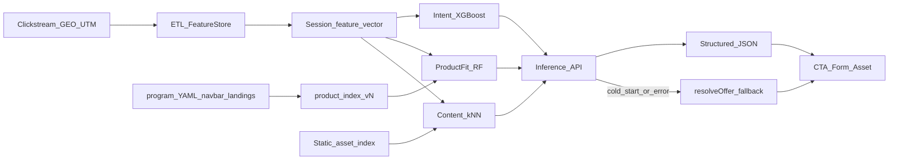
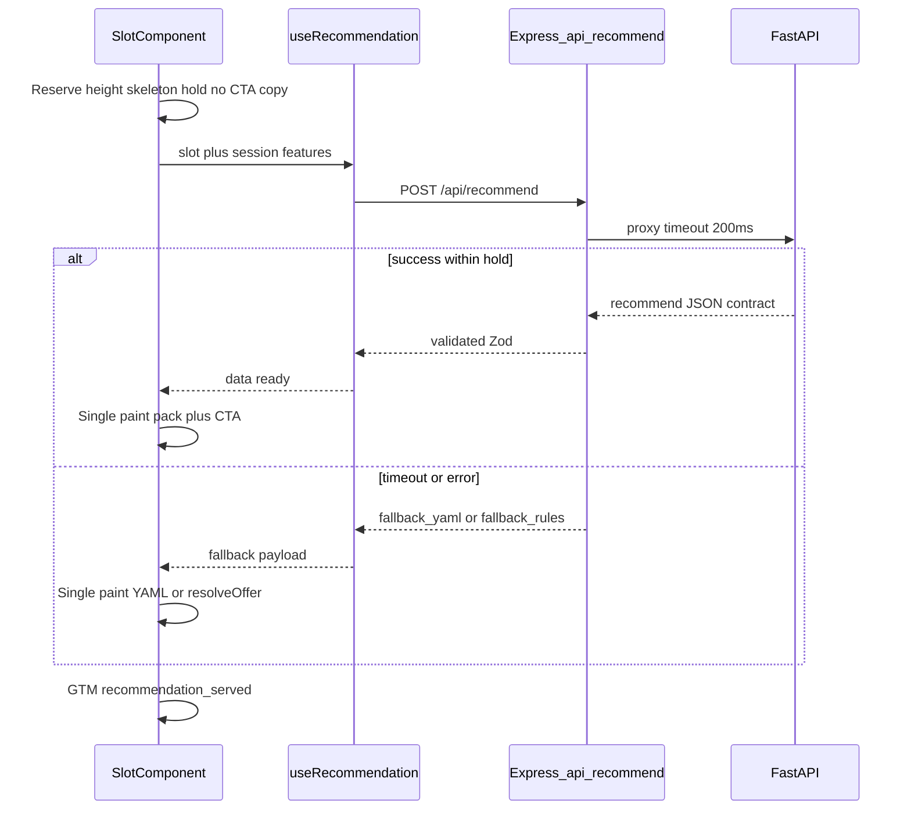

# Plan: Recomendador Opción 2 — ML tradicional (sin RAG)

## Qué modelos usa el ML

Tres piezas especializadas (ML clásico, **sin LLM en inferencia**):

### 1. Intent — Cold / Warm / Hot

- **Modelo:** **XGBoost** (alternativa: LightGBM), multiclase 3.
- **Sale:** `intent_stage` + `strategy` (`hot` → `direct_sale`, si no `nurturing`).

### 2. Product fit — afinidad de producto (latente o venta)

- **Modelo:** **Random Forest o XGBoost** multiclase.
- **Clases:** los `product_id` del catálogo dinámico (no solo 3 fijos).
- **Rol según strategy:** en `**direct_sale`** = producto a ofrecer en UI; en `**nurturing**` = afinidad interna para filtrar assets / tono del pack — **no** CTA de compra ni override de `program` en el slot.
- **Apoyo de texto:** embeddings offline (**MiniLM** local u otro) sobre title + SEO/meta del program, para afinidad y cold start de productos nuevos — **solo en batch**, no en cada request.

### 3. Content / nurturing — qué asset servir

- **Modelo:** **k-NN** sobre embeddings estáticos de assets (mismo tipo de embedder en job offline).
- Más adelante, si hay volumen: matrix factorization click→asset.
- **Sale:** `recommended_asset_type` + `recommended_asset_id` solo si `strategy === nurturing`.

**En runtime (FastAPI):** carga intent + fit (+ índice de assets/productos) en memoria → ~10–30 ms.  
**No** GPT/OpenRouter en el path de recommend; Qdrant del admin **no** se usa para el visitor (solo opcional para precomputar embeddings offline).

**Default del diagrama:** Intent = XGBoost, Fit = RF/XGB, Assets = k-NN + MiniLM offline.




---

## Qué ya existe vs qué falta


| Capacidad                                  | Estado en website-v3                                                                                                                                                                                                                                                                                                        | Rol en Opción 2                                                                                                                                                                                                                                                                                                                                                                                                                                                                                                                                                                                                                                                                                                                                                                                                                                                                                                                                                                                                                                                                                                                                                      |
| ------------------------------------------ | --------------------------------------------------------------------------------------------------------------------------------------------------------------------------------------------------------------------------------------------------------------------------------------------------------------------------- | -------------------------------------------------------------------------------------------------------------------------------------------------------------------------------------------------------------------------------------------------------------------------------------------------------------------------------------------------------------------------------------------------------------------------------------------------------------------------------------------------------------------------------------------------------------------------------------------------------------------------------------------------------------------------------------------------------------------------------------------------------------------------------------------------------------------------------------------------------------------------------------------------------------------------------------------------------------------------------------------------------------------------------------------------------------------------------------------------------------------------------------------------------------------- |
| Sesión + **Features de usuario**           | **Ya en sesión** (`[shared/session.ts](shared/session.ts)` + Session worker): `userId`, `location`/`geo` (país, región → `geo_tier`), `language`, `utm_*` (+ PPC/ref), `device` (mobile/desktop…). Es el **contexto de entrada** del visitante, no aún el vector ML.                                                        | **Features de usuario** = fila agregada (`user_session_features`) que alimenta Intent + Product-fit: contexto de sesión **más** comportamiento. **Añadir a sesión / summary (cliente):** contadores vivos de la visita (`n_clicks_*`, `clicks_by_content_type`, `program_views`, `time_on_site_s`, `depth_pages`, `form_starts`, `return_visit`) y, si existen, `persona`/`goal`. **Persistir en Postgres** vía `POST /api/events` → ETL; el modelo no lee solo GEO/UTM: necesita ese vector de clicks y engagement. Detalle en §1.2.                                                                                                                                                                                                                                                                                                                                                                                                                                                                                                                                                                                                                                |
| Eventos definidos — **fase 1** (prioridad) | `[tracking.ts](client/src/lib/tracking.ts)`; hoy solo conversiones en LeadForm                                                                                                                                                                                                                                              | Cablear + persistir: `[hero](client/src/components/hero)`, `[sticky_cta](client/src/components/sticky_cta)` / `[cta_banner](client/src/components/cta_banner)` / `[double_cta](client/src/components/double_cta)`, `[pricing](client/src/components/pricing)` (+ `[pricing_plans](client/src/components/pricing_plans)`), `[lead_form](client/src/components/lead_form)` soft links + `form_starts`, navbar **Programas** (`[Header](client/src/components/Header.tsx)` / menus), `page_view` (unificar route change). Suficiente para intent + product fit v1                                                                                                                                                                                                                                                                                                                                                                                                                                                                                                                                                                                                       |
| Eventos definidos — **fase 2** (resto)     | Mismo `track("cta_click")` / collector                                                                                                                                                                                                                                                                                      | Ampliar cobertura: `[enrollment_selector](client/src/components/enrollment_selector)`, `[apply_form](client/src/components/apply_form)`, `[course_selector](client/src/components/course_selector)`, `[programs_showcase](client/src/components/programs_showcase)`, `[programs_list](client/src/components/programs_list)`, `[ai_flex_path](client/src/components/ai_flex_path)` / `[ai_flex_selector](client/src/components/ai_flex_selector)`, `[features_quad](client/src/components/features_quad)` / `[features_grid](client/src/components/features_grid)`, `[why_learn_ai](client/src/components/why_learn_ai)`, `[human_and_ai_duo](client/src/components/human_and_ai_duo)`, `[ai_learning](client/src/components/ai_learning)`, `[faq](client/src/components/faq)`, `[syllabus](client/src/components/syllabus)`, `[banner](client/src/components/banner)`, `[two_column](client/src/components/two_column)`, `[partnership_carousel](client/src/components/partnership_carousel)`, `[survey](client/src/components/survey)`, Overlays marketing; discovery (`interactive_exercise`, assets, `how-to`); resto de links del navbar; `scroll_depth` (50/75) |
| GTM / sGTM / GA4                           | GTM-PGGRR6, `[docs/gtm-analytics-setup.md](docs/gtm-analytics-setup.md)`                                                                                                                                                                                                                                                    | `track()` → GTM → GA4; **GA4→BQ es paralelo**. Fuente del recomendador = `POST /api/events` → Postgres                                                                                                                                                                                                                                                                                                                                                                                                                                                                                                                                                                                                                                                                                                                                                                                                                                                                                                                                                                                                                                                               |
| Leads / conversiones                       | `buildLeadPayload`, conversion_name                                                                                                                                                                                                                                                                                         | Labels de entrenamiento (quién aplicó / compró)                                                                                                                                                                                                                                                                                                                                                                                                                                                                                                                                                                                                                                                                                                                                                                                                                                                                                                                                                                                                                                                                                                                      |
| Productos (dinámicos)                      | Content type `program` en `site_*/programs/` (slugs actuales y futuros), menú Programas en navbar, landings que venden vía `lead_form.program`/`bc_slug`. SEO: `meta.page_title` + `meta.description` (+ `title`, `job_role`, `seo.`*). **No es una lista fija** — se crean/amplían contenidos y productos en la plataforma | Job `build_product_catalog` → `product_index_vN` (ids, textos SEO, landings asociadas, embeddings offline). Clases del product-fit = catálogo vigente en cada train; `catalog_version` en serving. Producto nuevo sin conversiones → afinidad por embedding de meta + reglas hasta retrain. **Pipeline webhook:** tras push a GitHub que toque navbar/menus (y programs/landings/SEO), el webhook existente dispara rebuild del catálogo                                                                                                                                                                                                                                                                                                                                                                                                                                                                                                                                                                                                                                                                                                                             |
| Qdrant + embeddings                        | `[vector-search.ts](server/vector-search.ts)`                                                                                                                                                                                                                                                                               | **No usado en inferencia visitor**; opcional solo para **precomputar** embeddings estáticos de assets offline                                                                                                                                                                                                                                                                                                                                                                                                                                                                                                                                                                                                                                                                                                                                                                                                                                                                                                                                                                                                                                                        |
| OpenRouter / LLMService                    | Admin AI                                                                                                                                                                                                                                                                                                                    | **Fuera del path de recommend**                                                                                                                                                                                                                                                                                                                                                                                                                                                                                                                                                                                                                                                                                                                                                                                                                                                                                                                                                                                                                                                                                                                                      |
| Redis / Feature Store / FastAPI            | No existen aún                                                                                                                                                                                                                                                                                                              | v1: FastAPI + jobs en `services/recommender/`; app Node solo proxy + eventos                                                                                                                                                                                                                                                                                                                                                                                                                                                                                                                                                                                                                                                                                                                                                                                                                                                                                                                                                                                                                                                                                         |
| DB visitantes                              | Solo cookie/`localStorage`; SQLite es staff/AI chat                                                                                                                                                                                                                                                                         | Event store + features fuera o tablas nuevas                                                                                                                                                                                                                                                                                                                                                                                                                                                                                                                                                                                                                                                                                                                                                                                                                                                                                                                                                                                                                                                                                                                         |


**Default de stack (concreto) — v1 mismo repo, ordenado:**

- **Monorepo (decisión v1):** todo vive en **website-v3**. El cerebro ML no se mezcla con `client/` ni `server/` Node: carpeta dedicada `[services/recommender/](services/recommender/)` (Python: FastAPI, training, `product_index`, embeddings, Dockerfile, jobs). Extracción a repo Git aparte = **fase posterior** solo si ops/ML lo exige.
- **App Node/React:** tracking, `POST /api/events`, proxy `POST /api/recommend`, Zod en `shared/recommender.ts`, UI slots, Cursor rules de feeding, webhook GitHub que dispara rebuild **in-process o HTTP localhost/servicio** del container recommender — sin entrenar modelos dentro de handlers Express.
- **Eventos (v1):** dos destinos, sin Segment ni CDP de pago.
  1. `**track("cta_click"|…)`** → dataLayer → GTM → GA4 (y opcional **GA4→BQ** para analytics/marketing).
  2. **Collector propio `POST /api/events`** → **Postgres** (fuente first-party del recomendador / feature store). El front, al cablear CTAs, hace **ambos**: GTM vía `track()` y batch/persist al collector. BQ del GA4 **no** reemplaza `/api/events`.
- **Feature store:** tablas en **Postgres** (`user_session_features` / agregados), alimentadas desde `/api/events`; leídas por jobs en `services/recommender/`. **GA4→BQ = bootstrap histórico** para el primer train / labels; no sustituye el stream de `/api/events`.
- **Serving:** contenedor FastAPI (mismo repo, deploy aparte p.ej. Cloud Run o compose local) ← Express proxy.
  - **Puertos (obligatorio):** Express usa `PORT` (default **5000**). El contenedor del recomendador **no** puede publicar el mismo host port. Default local: FastAPI **`8090`** (o `RECOMMENDER_PORT`); map Docker `8090:8090` (o `8090:8000` si uvicorn escucha 8000 *dentro* del container). Express proxy → `http://127.0.0.1:8090` (o `RECOMMENDER_URL`). En compose/prod, no reusar `5000` en el servicio ML.
- **UX slot + cold start / errores:** **no** pintar copy YAML al instante y luego overlay (evita flash venta↔nurturing). Con `recommender.enabled`: **hold ~200ms** (skeleton / misma altura, sin CTA legible) → **una sola pintura**. Timeout Express **200ms**. Cascada de contenido al revelar:
  1. ML/cache listo → pintar pack + destino (asset o venta).
  2. Timeout/error + YAML con defaults útiles → revelar **ese** fallback (primera vez que el usuario ve copy).
  3. YAML sin fallback útil → `**resolveOffer`** en Express; revelar reglas.
  4. Sin reglas → no romper layout (ocultar slot o CTA mínimo seguro).
- **Contrato:** `shared/recommender.ts` = fuente de verdad del JSON (Zod). OpenAPI FastAPI alineado. En Cursor rules (`services-recommender.mdc` / `recommender-feeding.mdc`): cambio de contrato → `**warnings`** obligatorio: actualizar `shared/recommender.ts` en el mismo cambio (+ `next_actions` para proxy/UI/OpenAPI).

---

## Layout ordenado (v1 monorepo)

```text
website-v3/
  client/                  # tracking, TrackedCtaLink, UI slots, GTM
  server/                  # /api/events, /api/recommend proxy, webhook → rebuild trigger
  shared/recommender.ts    # Zod contract (EN)
  services/recommender/    # isolated Python package — do not import from client/server TS
    app/                   # FastAPI inference
    training/              # intent, product-fit, retrain scripts
    catalog/               # build_product_catalog, embeddings, asset_index
    models/                # versioned artifacts (or object storage refs)
    Dockerfile
    pyproject.toml / requirements.txt
    README.md
  .cursor/rules/
    cta-tracking.mdc
    recommender-feeding.mdc
    services-recommender.mdc   # globs: services/recommender/** (boundary + MLOps)
```


| Capa app (Node/React)                                                                      | Capa `services/recommender/`                                      |
| ------------------------------------------------------------------------------------------ | ----------------------------------------------------------------- |
| `track` / `TrackedCtaLink`, feeding rules                                                  | Training intent / product-fit / asset k-NN                        |
| `POST /api/events`, session summary, GTM                                                   | Feature ETL, retrain cron scripts                                 |
| Proxy `POST /api/recommend` + Zod + cache + timeout 200ms + fallback YAML → `resolveOffer` | FastAPI inference, model registry, `product_index` + embeddings   |
| Webhook push → trigger rebuild                                                             | Job `rebuild_product_catalog` (lee `site_*` local o content root) |
| UI slots, `useRecommendation`                                                              | Dockerfile / compose service; `model_version` / `catalog_version` |


**Orden:** no meter `import` Python↔TS cruzado; no poner training en `server/routes`. CI puede lint/test Node sin instalar XGBoost; job/Docker separado para el servicio ML. Content (`site_`*) sigue en content folders; el catalog job lee el mismo root que el CMS.

---

## Contrato de salida

```json
{
  "intent_stage": "cold|warm|hot",
  "strategy": "nurturing|direct_sale",
  "recommended_product": "<product_id_from_catalog|null>",
  "recommended_asset_type": "blog|interactive_exercise|lead_magnet|cta_banner|program",
  "recommended_asset_id": "blog/slug-or-asset_123",
  "secondary_product": "<product_id_from_catalog|null>",
  "offer_pack_id": "nurturing_ai-flex_es_v1",
  "copy": {
    "headline": "Practica IA a tu ritmo",
    "subhead": "Empieza con un ejercicio guiado",
    "cta_label": "Abrir ejercicio"
  },
  "source": "ml|cache|fallback_yaml|fallback_rules",
  "model_version": "intent_v3+fit_v2+rec_v1",
  "catalog_version": "product_index_vN"
}
```

`recommended_product` / `secondary_product` = `product_id` del índice (no enum fijo).

**Copy / campos de marketing (coherencia título ↔ CTA ↔ destino):** esta Opción 2 **no genera texto con LLM** en inferencia. El ML elige un `**offer_pack`** preaprobado **a grano grueso** + (si nurturing) un **asset dinámico** del índice — **no** un pack humano por cada uno de los ~500 assets.

**Qué es un pack (escalable):**

- `**direct_sale`:** clave `(direct_sale, product_id, locale, slot)` — copy de venta + destino apply/program.
- `**nurturing`:** clave `(nurturing, locale, slot)` o, como matiz de tono, `(nurturing, affinity_product_id, locale, slot)` — copy educativo; destino siempre el asset. El product_id aquí es **tono/rieles**, no “producto en oferta”.
- Del orden de decenas, no cientos. **No** un pack por blog/exercise.

**Nurturing + muchos assets (sin “vender” producto en UI):**

En nurturing **no** se le recomienda al usuario un producto como CTA de compra. El `recommended_product` del product-fit es una **señal interna** (afinidad / riel del funnel: ¿contenido hacia Engineering vs Flex?) para filtrar el k-NN de assets — no para pintar “Compra AI Flex”.

1. Intent → `strategy: nurturing` (cold/warm).
2. Product-fit → `recommended_product` **latente** (solo para ranking de contenido / pack de tono).
3. Asset model → `recommended_asset_type` + `recommended_asset_id` (de los ~500).
4. Pack **nurturing** (por locale/slot, opcionalmente matizado por afinidad de producto): plantilla de copy educativo + `{asset_title}`; **destino = asset**, nunca apply/checkout.
5. `recommended_product` puede ir en el JSON para analytics/GTM, pero el overlay del slot **no** mapea a `program`/apply en strategy nurturing.

**Direct sale:** ahí sí el producto es la oferta visible (pack venta + apply/`program`).

Ejemplo nurturing: pack genérico o “tono flex” + exercise → “Practica IA a tu ritmo” / href del exercise.  
Ejemplo direct_sale: pack Engineering + “Conviértete en ingeniero” / apply.

**Pintura del slot (decisión v1):** hold corto → **una** revelación. Defaults YAML = fallback tras timeout, **no** primer mensaje visible.

**Scope v1 (importante):** el ML elige **strategy** + (si venta) **producto visible** + **offer_pack** + (si nurturing) **asset**. Product-fit corre siempre, pero en nurturing solo alimenta ranking/tono. **No** elige precios/cupones/variantes promo. Ver **Desarrollo posterior**.

Latencia objetivo de inferencia: **< 50ms** en el servicio ML (sin red); E2E con proxy ~100–150ms; **timeout Express / hold UI 200ms** → cascada fallback YAML → `resolveOffer`.

### Cómo lo usa el frontend (después del contrato)

Sí: ese JSON es exactamente lo que el browser recibe de `**POST /api/recommend`** (vía Express). El componente **no** habla con FastAPI directo.




**Hook (uno por página o compartido):** `useRecommendation({ slot, enabled })`  

- Si `recommender.enabled !== true` → no fetch; pintar YAML al instante (comportamiento actual).  
- Si enabled → POST con `{ slot, user_id, …features }` (o solo `user_id` y el server lee feature store).  
- Devuelve `{ data, status: 'loading'|'ready'|'fallback', source }`.  
- Mientras `loading` (hasta ~200ms): el slot **no** muestra headline/CTA definitivos.

**Lectura en el componente (ejemplo `sticky_cta`):**

```tsx
// Pseudocode — hold then single paint (no YAML→ML flash)
const defaults = props.data;
const { data: rec, status, source } = useRecommendation({
  slot: defaults.recommender?.slot ?? "sticky_cta",
  enabled: defaults.recommender?.enabled === true,
});

if (status === "loading") {
  return <SlotSkeleton height={defaults.recommender?.skeletonHeight} />;
}

const pack = rec; // ml|cache|fallback_yaml|fallback_rules — already chosen
const headline = pack?.copy?.headline ?? defaults.headline;
const ctaLabel = pack?.copy?.cta_label ?? defaults.cta_text;
const ctaHref =
  pack?.strategy === "nurturing" && pack?.recommended_asset_id
    ? pathForAsset(pack.recommended_asset_type, pack.recommended_asset_id)
    : pack?.destination ?? defaults.cta_url;
const program =
  pack?.strategy === "direct_sale"
    ? (pack?.recommended_product ?? defaults.program)
    : defaults.program;
```

**Mapa típico pack → props del componente** (declarado por schema del slot):


| Campo del contrato / pack                                       | Prop YAML del componente        |
| --------------------------------------------------------------- | ------------------------------- |
| `copy.headline`                                                 | `title` / `headline`            |
| `copy.subhead`                                                  | `subtitle` / `description`      |
| `copy.cta_label`                                                | `cta_text` / `buttons[0].label` |
| `recommended_asset_id` (si nurturing) / destino pack (si venta) | `cta_url` / `buttons[0].href`   |
| `recommended_product` **solo si** `strategy === direct_sale`    | `program` (lead_form / apply)   |


**Reglas de UI:**  

1. Con `recommender.enabled`: **hold** (skeleton / altura reservada) hasta ready|fallback (~200ms); **una sola** pintura de copy+CTA.
2. **No** mostrar defaults YAML visibles y luego sustituirlos por ML (evita flash nurturing↔venta).
3. Nunca mezclar headline de un pack con href de otro.
4. Si `strategy === nurturing`: copy + href del **asset**; **no** mapear `recommended_product` → `program`/apply.
5. Disparar GTM `recommendation_served` al revelar, con `source`, `offer_pack_id`, `model_version`.

---

## Fase 1 — Pipeline de captura y ETL

### 1.1 Event tracking

Persistir batch a `POST /api/events` con `{ user_id, session_id, event, props, ts }` (cookie `4g_user_id`). GEO + UTM ya en sesión. Hard conversion en LeadForm ya vía `trackFormSubmission`.

**Fase 1 — prioridad (cablear primero):**

- `[hero](client/src/components/hero)` — CTAs
- `[sticky_cta](client/src/components/sticky_cta)`, `[cta_banner](client/src/components/cta_banner)`, `[double_cta](client/src/components/double_cta)`
- `[pricing](client/src/components/pricing)` / `[pricing_plans](client/src/components/pricing_plans)`
- `[lead_form](client/src/components/lead_form)` soft links + `form_starts`
- Navbar **Programas** (dropdown de productos en Header/menus)
- `page_view` (path, contentType/slug si aplica; unificar route change)

**Fase 2 — resto:**

- Resto de CTAs de sección (`enrollment_selector`, `apply_form`, `course_selector`, `programs_`*, `ai_flex_*`, `features_*`, `why_learn_ai`, `human_and_ai_duo`, `ai_learning`, `faq`, `syllabus`, `banner`, `two_column`, `partnership_carousel`, `survey`, Overlays)
- Discovery: interactive exercises, assets, how-tos
- Resto de links del navbar (no solo Programas)
- `scroll_depth` (umbrales 50/75)

**Cursor rules (required, English):** create `[.cursor/rules/cta-tracking.mdc](.cursor/rules/cta-tracking.mdc)` and `[.cursor/rules/recommender-feeding.mdc](.cursor/rules/recommender-feeding.mdc)` — see section **Development rules**. Ship both with phase-1 wiring; physical component instrumentation still follows phase 1 → phase 2.

### 1.2 Feature store

Agregaciones por `user_id` / sesión activa, alimentadas desde `/api/events` → Postgres. GA4→BQ se usa como **bootstrap histórico** para el primer train; el stream operativo del recomendador es Postgres.

**Usuario / contexto**

- `geo_tier` desde `location.region` de sesión: **`US` | `LATAM` | `EU`** (mapear `usa-canada`→`US`, `latam`→`LATAM`, `europe`→`EU`). **No** fusionar LATAM+EU.
- **`online` no es un geo_tier.** En el producto, `online` es **campus/modalidad** (slug de academy / opción de form, p.ej. “Online”), no un país ni un perfil GEO. El session worker **excluye** `slug === 'online'` al resolver ubicación por IP; casi nadie queda con `region: 'online'`. Si hace falta para el modelo, va como feature aparte (`preferred_modality` / academy slug), no mezclado con GEO.
- Además: `country` / `country_code` crudos (sesión) para que el fit no dependa solo del tier.
- **No confundir con pricing:** el list price “US vs LATAM-EU” puede ser un **bucket comercial** (`price_geo_bucket`); **no** es el `geo_tier` ML.
- `device_category`, `language`
- `utm_source/medium`, bucket `utm_intent` (high/branded vs free/beginner)

**Comportamiento**

- `n_clicks_technical`, `n_clicks_beginner` — contadores de clicks cuyo destino (asset/how-to/exercise/blog) se clasifica por `difficulty` / tags (`hard`/`advanced`/`technical` → technical; `easy`/`beginner`/`intro` → beginner)
- `n_clicks_brand` — clicks a destinos de marca/empresa (ver reglas de bucket abajo); p.ej. about, careers, upcoming-dates como `page`, press, trust
- `n_clicks_campaign` — clicks a **landings** (performance/venta); distintas de brand y de learning
- `clicks_by_content_type` — mapa JSON con **todos** los content types relevantes: `program`, `landing`, `page`, `blog`, `how-to`, `interactive_exercise`, etc.
- `program_views` como mapa dinámico `{ [product_id]: count }` (no columnas fijas por tres cursos)
- `time_on_site_s`, `depth_pages`
- `form_starts`, `return_visit` (7d)

**Cómo se decide el bucket de un click (navbar incluido):**

No se etiqueta el ítem del menú a mano en cada rediseño. Se resuelve el **destino** (`href` → contentType + slug) y se aplica:

1. **Por `contentType` (default v1):**
  - `blog` / `how-to` / `interactive_exercise` / downloadable → **learning** (+ technical/beginner si hay difficulty)
  - `program` → **product** (también incrementa `program_views[product_id]`)
  - `landing` → **campaign** (`n_clicks_campaign`)
  - `page` / `location` → **brand** (`n_clicks_brand`) — incluye una page nueva tipo “upcoming dates”
2. **Override opcional `recommender_bucket`:** `brand|campaign|product|learning` — **no es obligatorio** en todos los YAML. Solo donde el default por `contentType` mienta (p.ej. una `page` que es lead magnet). Dónde se permite:
  - Entradas de contenido (`_common.yml` / locale de `page`, `landing`, `program`, `blog`, how-to, exercise, etc.) vía schema/field mapping del content type
  - Items de menú/navbar si el href es ambiguo o externo
  - **No** en section components (`hero`, `cta_banner`, …): el bucket es del **destino**, no del componente CTA
3. **Navbar:** al click, mismo pipeline: resolver URL → contentType/slug → bucket. Añadir “Upcoming dates” al menú no requiere lógica nueva: si apunta a `page/upcoming-dates`, cuenta como **brand** hasta que alguien ponga override.

**Persona**

- `persona`, `goal` cuando existan (form / `ai_flex_selector`); one-hot o categorical encoded

Job ETL diario/horario: eventos crudos → fila de features (script Node/Python sobre Postgres; opcionalmente cruce con BQ histórico).

**Ejemplo de fila `user_session_features`:**

```json
{
  "user_id": "usr_8f3a2c",
  "session_id": "ses_91bb",
  "updated_at": "2026-07-27T21:40:00Z",
  "geo_tier": "LATAM",
  "country": "CO",
  "country_code": "CO",
  "device_category": "mobile",
  "language": "es",
  "utm_source": "google",
  "utm_medium": "cpc",
  "utm_intent_bucket": "high",
  "time_on_site_s": 180,
  "depth_pages": 5,
  "n_clicks_technical": 4,
  "n_clicks_beginner": 1,
  "n_clicks_brand": 2,
  "n_clicks_campaign": 1,
  "clicks_by_content_type": {
    "program": 2,
    "landing": 1,
    "how-to": 1,
    "page": 2,
    "blog": 3,
    "interactive_exercise": 1
  },
  "form_starts": 1,
  "return_visit_7d": false,
  "program_views": {
    "ai-engineering": 0,
    "ai-fluency": 1,
    "ai-flex": 2
  },
  "persona": "professional",
  "goal": null,
  "product_affinity": {
    "ai-flex": 0.72,
    "ai-fluency": 0.41
  }
}
```

---

## Fase 2 — Tres modelos especializados

### 2.1 Intent classification (Cold / Warm / Hot)

- **Algo:** XGBoost o LightGBM (multiclase 3)

**Quién define vs quién infiere**

- **Nosotros (negocio + data) definimos el significado** de las 3 clases al **entrenar**: qué sesiones cuentan como cold / warm / hot (labels). Sin labels no hay “entendimiento” mágico.
- **El modelo no recibe** `intent_stage` de entrada. Recibe el vector de features y **infiere** `P(cold)`, `P(warm)`, `P(hot)`.
- **Nosotros fijamos el mapeo de salida:** `hot` → `direct_sale`; `cold|warm` → `nurturing` (regla de producto, no aprendida).

| Fase | Quién | Qué hace |
|------|--------|----------|
| Bootstrap (día 0) | Marketing/data | Heurísticas → labels: p.ej. 1ª visita SEO / solo blog → **cold**; engagement medio, `form_starts`, return → **warm**; `student_application` / pricing profundo → **hot** |
| Train | XGBoost | Aprende features → clase (a partir de esos labels + luego conversiones reales) |
| Runtime | Modelo | Mira features actuales → predice etapa; **no** es una máquina de estados que “pasamos” a hot a mano |

- **No es una máquina de estados manual.** En cada `POST /api/recommend` el modelo recibe el vector actual de `user_session_features` y devuelve scores; se elige la clase (o umbrales). Si el usuario hace más clicks / abre form / vuelve, las features cambian y **la próxima** inferencia puede dar otro `intent_stage` — no hay un evento mágico “pasó a hot”.
- **Qué empuja hacia hot (aprendido + bootstrap):** patrones correlacionados con conversión en train — p.ej. `form_starts`, vistas de pricing/program, return visit, UTM high-intent, menos solo browsing de blog.
- **Labels:** heurística inicial (matriz + `conversion_name`) → luego labels reales (aplicación / purchase webhook). Retrain mejora el umbral cold/warm/hot con datos, no con ifs en el front.
- **Output:** `intent_stage` + `strategy` (`hot`→`direct_sale`, else `nurturing` con matices warm)

**Cómo sabe qué recomendar (cadena):**

1. Intent model → `intent_stage` + `strategy` (`nurturing` vs `direct_sale`)
2. Product-fit → `recommended_product` (en **nurturing** = afinidad interna para filtrar contenido; en **direct_sale** = producto a ofrecer en UI)
3. Si `nurturing` → asset k-NN → asset id; pack nurturing + destino = contenido (no CTA de compra)
4. Si `direct_sale` → pack de venta + apply/`program`; asset null
5. Una sola pintura del pack (tras hold); si falla → cascada YAML → `resolveOffer`

### 2.2 Catálogo dinámico de productos + product fit

Los productos **cambian**: nuevos `program`, cambios de navbar, landings de venta. No entrenar contra una lista fija.

**Descubrimiento (`build_product_catalog` → `product_index_vN`):**

1. Entradas `program` con `valid_lead_form_option !== false` (mismo criterio que lead forms / `GET /api/career-programs`).
2. Items del dropdown Programas en el navbar (pueden incluir cursos aún no seleccionables en form).
3. Landings cuyo `lead_form` / secciones declaren `program`/`bc_slug` → superficie de oferta del mismo `product_id` (no clase nueva). Landings sin product_id resoluble → warning del job, no entran como clase.
4. **ID canónico:** `bc_slug` si existe, si no `slug` del program.

**Texto para que el modelo entienda de qué trata el curso (batch, no en request):** por producto/locale: `title` + `meta.page_title` + `meta.description` (+ `job_role`, `seo.intent`/`seo.pillar` si hay). Embeddings offline (MiniLM local u otro) → vectores en el índice. Al crear contenido/producto nuevo o editar SEO → regenerar catálogo + retrain fit.

**Product fit:**

- **Algo:** Random Forest o XGBoost multiclase con **clases = product_ids del catálogo en ese train**
- **Features:** persona, clicks técnicos vs beginner, `program_views` dinámicos, GEO, UTM, scores de afinidad sesión↔embedding de producto
- **Output:** `recommended_product` (+ opcional `secondary_product` en **direct_sale** / downsell). En **nurturing** el id es afinidad para filtrar k-NN / tono del pack; la UI no lo trata como oferta.
- **Cold start producto nuevo:** ranking por similitud embedding (meta) + reglas hasta haber leads con ese `program`

**Pipeline de actualización de catálogo (webhook GitHub):**

Sí — reutilizar el push webhook ya cableado en `[POST /api/github/webhook](server/routes/github.ts)` (firma HMAC, auto-pull, `changedFiles` por commit). Tras un pull exitoso (o en paralelo si el contenido ya está local):

1. Si algún path en `changedFiles` matcha catálogo relevante — p.ej. `**/menus/`**, `**/programs/**`, `**/landings/**` — tras pull, Express dispara **async** rebuild hacia el servicio `services/recommender/` (HTTP interno o cola); no corre training dentro del handler del webhook.
2. El servicio regenera `product_index_vN` + embeddings SEO/meta, publica `catalog_version` y hot-reload del índice; **no** reentrena XGBoost en cada push de menú — solo el índice/embeddings.
3. Retrain completo del product-fit sigue en cron de `**services/recommender/`** (o se dispara solo si el set de `product_id` cambió — alta/baja de clase — no en meros reorder/copy del dropdown).
4. Log en sync log (`WEBHOOK`): trigger enviado; detalle del rebuild en logs del servicio recommender.

Fallback: el cron semanal sigue haciendo rebuild por hash si un push se perdió o el webhook falló.

### 2.3 Content / asset recommendation (nurturing)

- **Algo:** k-NN sobre **embeddings estáticos precomputados** de assets (batch offline; puede usar el mismo MiniLM local **solo en job**, no en request path) **o** matrix factorization cuando haya suficiente co-ocurrencia click→asset
- **Catálogo:** inventario `{contentType}/{slug}` + difficulty + tags (scan `site_`* vía contentLoader)
- **Output:** `recommended_asset_type` + `recommended_asset_id` solo si `strategy === nurturing`

Artefactos versionados: `models/intent_vN.json|ubj`, `fit_vN`, `product_index_vN`, `asset_index_vN` + metadata en el serving.

---

## Fase 3 — Inferencia en tiempo real (MLOps)

1. Frontend envía JSON ligero (features ya agregadas en cliente **o** solo `user_id` y el server lee feature store):

```json
{
  "user_id": "...",
  "geo_tier": "LATAM",
  "clicks_technical": 4,
  "time_on_site_s": 180,
  "persona": "professional",
  "program_views": { "<product_id>": 1, "<otro_product_id>": 2 }
}
```

1. FastAPI carga modelos + `product_index` en memoria → predicción 10–30ms → JSON contrato (producto ∈ catálogo vigente).
2. Express: `POST /api/recommend` proxy + Zod + caché (LRU; Redis si escala) + **timeout 200ms**.
3. **Fallback (cascada al revelar):** timeout/error/low confidence → (1) defaults del YAML; (2) si el YAML no trae fallback útil → `resolveOffer`; (3) último recurso: no romper layout. Slots con `recommender.enabled` **deben** declarar defaults YAML *o* estar cubiertos por `resolveOffer`.
4. Hook `useRecommendation(slot)`: **hold ~200ms** → una pintura; GTM `recommendation_served` con `source: ml|cache|fallback_yaml|fallback_rules`.

**No** edge LLM; el “edge” aquí es un servicio pequeño cerca de la app. Cloudflare Worker opcional solo como proxy de caché, no para entrenar.

---

## Fase 4 — Re-entrenamiento automatizado

- **Cron semanal/mensual** (GitHub Action / Cloud Scheduler) — safety net + retrain modelos:
  1. Rebuild `product_index` si cambió hash vs `catalog_version` en prod (por si falló el webhook)
  2. Export features + labels (leads con `program` + conversiones GTM/CRM)
  3. Reentrenar intent + fit (clases = catálogo actual); evaluar AUC/F1 vs holdout y vs baseline reglas
  4. Si métricas ≥ umbral → publicar `model_version` + `catalog_version` y hot-reload o redeploy serving
  5. Si no → conservar versión anterior + alerta
- **Push webhook (path caliente):** cambio de navbar/menus (y programs/landings/SEO) → solo rebuild de `product_index` + embeddings; retrain fit solo si el set de product_ids cambió
- Shadow mode 1–2 semanas: loggear predicción ML vs reglas sin cambiar UI, comparar lift en `student_application` / CTR CTA.

---

## Fase 5 — Integración app (superficie mínima)

Misma carpeta git; **límites claros** entre Node y `services/recommender/`:

- Cableado eventos + session summary + `POST /api/events`
- `shared/recommender.ts` (contrato) + proxy `/api/recommend` → FastAPI del servicio recommender
- Slots piloto: `sticky_cta`, CTA blog (nurturing → asset; sale → pack producto); override `program` en lead_form **solo** cuando `routing: auto` **y** `strategy === direct_sale`
- **Offer packs** en DebugBubble (menú Marketing / junto a Tracking–Conversions): listar, crear, editar packs; how-it-works visible para staff
- GTM `recommendation_served` con `source: ml|fallback`, `model_version` y `catalog_version`
- Webhook push → trigger rebuild catálogo en el servicio recommender

**No** meter training/XGBoost dentro de `server/routes`. **No** importar Python desde el bundle Vite. **No** colección Qdrant visitor ni OpenRouter en este path. Extraer a repo Git externo = post-v1 si hace falta.

### Flujo marketing (cómo usar un componente con el recomendador)

**No** hace falta una versión del componente por cada producto/estrategia. Un solo `sticky_cta` (o `cta_banner`, etc.) sirve; cambian los **datos**.

1. **En la página:** insertás el componente de siempre, rellenás el YAML **default** (fallback si ML falla/timeout — **no** se muestra antes del hold) + activás el slot:

```yaml
   recommender:
     enabled: true
     slot: sticky_cta
   

```

1. **Offer packs (no 1 por asset):** marketing mantiene packs en **DebugBubble → Marketing → Offer packs** (decenas).
  - `direct_sale` + `ai-engineering` + `es` → títulos/CTA **apply** (aquí sí se recomienda producto)
  - `nurturing` (+ opcional tono `ai-flex`) + `es` → plantilla **educativa**; asset concreto lo pone el k-NN; **sin** CTA de compra
2. **En runtime:** hold ~200ms → si nurturing: pack educativo + asset; si direct_sale: pack venta + product; si timeout: YAML/`resolveOffer`. Schema declara keys (`headline`→`title`, etc.).
3. **Escala:** packs de venta ≈ N productos × locales; packs nurturing ≈ pocos por locale/slot (+ tonos); **A assets** crecen sin multiplicar packs.
4. **Nuevo producto:** alta en catálogo + packs **de venta** en la cucaracha; nurturing no exige un pack de producto nuevo salvo matiz de tono.

---

## Development rules (app + `services/recommender`)

**Language:** all Cursor rules, code, commits, PR descriptions, schema comments, and agent task summaries for this work are **in English** (same as the rest of website-v3). Plan prose here may stay in Spanish for stakeholders; shipped artifacts are English.

### App layer — two rules (not one fat file)

1. `[.cursor/rules/cta-tracking.mdc](.cursor/rules/cta-tracking.mdc)` — globs: `client/src/components/`**, `client/src/components/menus/**`, `marketing-content/component-registry/**`
  Every marketing CTA / offer / content-nav link uses `TrackedCtaLink` (or `InternalLink` with tracking). Minimum payload: `label`, `section`, `destination`, plus `contentType` + slug/`asset_id` when applicable. Exceptions: social, legal, TOC, `tel:`/`mailto:`, breadcrumbs. Forms keep hard conversion via `trackFormSubmission`.
2. `[.cursor/rules/recommender-feeding.mdc](.cursor/rules/recommender-feeding.mdc)` — same globs (+ SEO/program/landing paths as needed)
  Any new/edited component with CTA or discovery/sale navigation must **keep feeding the recommender**. Before closing the PR/task, the agent/dev **must** emit a short **Recommender impact** block with `warnings`, `side_effects`, and `next_actions` (same shape as MCP). Do not skip this because the change is "UI only".

**Checklist (recommender-feeding) when creating/editing a component with CTA or content navigation:**

- Wire tracking (`TrackedCtaLink` / minimum payload).
- Document at least:

`**warnings`** (what breaks or goes stale without follow-up):

- CTA without track → model never sees the signal.
- Link to program / exercise / how-to / asset without `contentType`+slug → product-fit / nurturing blind to that click.
- Sales landing without resolvable `program`/`bc_slug` → excluded from `product_index` (catalog job warning).
- Changing asset labels/difficulty/tags → k-NN index stale until rebuild.
- Changing program `meta.description` (or emptying SEO copy) → product embeddings stale until catalog rebuild; **assume the ML uses that text — do not blank descriptions**.
- **Recommend JSON contract change** (new overlay fields, offer_pack/`copy` keys, slot payload) → **must update `[shared/recommender.ts](shared/recommender.ts)` in the same change** or Express/client drift; emit this as an explicit `warnings` entry in the Recommender impact block.

`**side_effects`** (what the change does *not* do):

- Does not retrain XGBoost just because a component was added.
- Does not create an ecommerce (`purchasable`) product.
- Does not edit `services/recommender/` training code from a pure UI PR; only produces events/content.
- Does not replace hard conversion (`trackFormSubmission`) when the surface is a form.

`**next_actions*`* (concrete paths):

- If there is a CTA: use tracking primitive; verify TrackingPage sample.
- If selling a new product or editing Programas navbar: push → GitHub webhook → catalog rebuild; if `product_id` set changed, retrain fit under `services/recommender/training/`.
- If nurturing (exercise/how-to/asset): after publish, `rebuild_asset_index` on the recommender service.
- If the component will be a recommender slot: honor `/api/recommend` contract + YAML fallback.

**Example — add `foo_banner` with CTA:**

```text
warnings: Without TrackedCtaLink, foo_banner clicks never reach the feature store.
side_effects: Does not retrain models; does not update product_index.
next_actions: Wire TrackedCtaLink (section=foo_banner); confirm event in TrackingPage sample; no catalog rebuild unless destination introduces a new product_id.
```

### `services/recommender/` — mirror rules (denser, English)

Create `[.cursor/rules/services-recommender.mdc](.cursor/rules/services-recommender.mdc)` (globs: `services/recommender/**`). Prefer `**warnings` / `side_effects` / `next_actions**` over long checklist prose. Cover:


| Concern            | Obligation                                                                                                                                |
| ------------------ | ----------------------------------------------------------------------------------------------------------------------------------------- |
| Inference contract | Recommend JSON aligned with `[shared/recommender.ts](shared/recommender.ts)`. No LLM on inference; <50ms target                           |
| Product catalog    | Dynamic catalog from programs + navbar + landings; SEO/title for embeddings; webhook rebuild ≠ full retrain                               |
| Training data      | Labels from conversions/`program` + rule bootstrap; document features; cold start via meta embedding                                      |
| Service boundary   | Do not edit marketing React/YAML from ML PRs except via documented contract; no imports into Vite bundle; read `site_*` from content root |


**Required `warnings` / `side_effects` / `next_actions`** on changes to contract, catalog, training, or serving — e.g.:

- `**warnings` (contract — mandatory):** If the recommend request/response shape changes (FastAPI models, OpenAPI, offer_pack/`copy` keys, new fields): **you must update `[shared/recommender.ts](shared/recommender.ts)` in the same change**, or the Express proxy and client types will drift. State this explicitly in the task/PR Recommender impact block — do not treat it as optional checklist prose only.
- `warnings`: feature schema / catalog drift can break Express proxy or prod models; stale client cache after contract bump.
- `side_effects`: catalog rebuild does not imply retrain; retrain does not invalidate historical events; updating `shared/recommender.ts` alone does not redeploy FastAPI.
- `next_actions`: bump `catalog_version` / `model_version`; align FastAPI Pydantic/OpenAPI with Zod; update Offer packs UI field map if `copy` keys changed; restart/reload FastAPI; shadow mode if contract changed.

Same contract `**warnings`** must appear in `recommender-feeding.mdc` when a slot/UI change depends on new recommend JSON fields.

`recommender-feeding` **pushes** `next_actions` toward `services/recommender/`; the service rule defines what to do when those triggers arrive.

### Delivery of rules

- Ship `cta-tracking.mdc` + `recommender-feeding.mdc` with **event wiring phase 1**.
- Ship `services-recommender.mdc` with `**services/recommender/` scaffold**.

---

## Education layer

**Staff (UI):** Recommender chooses **nurturing vs direct sale** from behavior. Slots with ML **hold ~200ms** (skeleton) then **one paint** — YAML defaults are fallback after timeout, not a first flash. **Nurturing** = educational asset (not product hard-sell). **Direct sale** = product packs. **Offer packs** in DebugBubble → Marketing. Catalog rebuilds via webhook; fallback = YAML then `resolveOffer`. Optional **Read more (advanced):** `cta-tracking.mdc`, `recommender-feeding.mdc`, `services/recommender/`, `POST /api/recommend`, Offer packs, `product_index`. Empty states: nurturing=content vs sale=product; banner when ML vs fallback.

**Agents (MCP):** Dense EN payloads — `warnings` / `side_effects` / `next_actions` with paths (e.g. editing an offer pack invalidates nothing until publish/rebuild; changing SEO meta needs catalog rebuild). Mutating tools follow [mcp-server-responses.mdc](.cursor/rules/mcp-server-responses.mdc).

---

## Orden de entrega

1. Scaffold `**services/recommender/`** (EN) + event collector fase 1 + feature store mínima + `**cta-tracking.mdc` + `recommender-feeding.mdc` + `services-recommender.mdc**`
2. Baseline labels + primer modelo intent en `services/recommender/training/`
3. Hook webhook → rebuild catálogo en el servicio recommender
4. Product fit v1 + Docker/FastAPI + proxy Express `/api/recommend`
5. Eventos fase 2 + asset k-NN en `services/recommender/`
6. UI slots + **Offer packs en DebugBubble (Marketing)** + GTM
7. Retrain cron + shadow mode → cutover

## Riesgos y prerequisitos

- **Datos:** sin clickstream histórico, el ML no supera reglas al día 1 → planificar 4–8 semanas de recolección + shadow  
- **Límites en monorepo:** disciplina de carpetas + Docker; **puerto ML ≠ Express** (no mapear 5000 al recommender); no contaminar `npm run build` con deps Python; fallback Express si el servicio ML está down  
- **Catálogo mutable:** alta/baja de productos o cambio de SEO exige rebuild (vía webhook) + retrain si cambian clases; producto nuevo sin labels → cold start por embedding  
- **Ops:** servicio Python en la misma git history pero deploy/ciclo distinto del Node app  
- **Content:** catalog job necesita `site_`* montado; difficulty tags para assets igual  
- **Ventaja v1:** un solo PR puede tocar tracking + contrato + job; menos fricción que un segundo GitHub; extracción a repo externo queda abierta post-v1

## Desarrollo posterior (importante — fuera de v1)

**Variantes de precio / oferta dentro del mismo producto.** Hoy el recomendador no decide “list price vs descuento” ni “qué promo mostrar” para un `product_id` ya elegido. Extensión prevista:

- **Señales nuevas:** `begin_checkout`, `add_to_cart`, abandono de checkout/carrito, vistas repetidas de pricing, tal vez `coupon` intentos fallidos.
- **Salida ampliada del contrato** (actualizar `shared/recommender.ts` + warning en Cursor rules): p.ej. `price_variant`, `coupon_code`, `offer_type: list|geo_tier|cart_abandon|winback`, o packs tipados `direct_sale_ai-engineering_us_discount10`.
- **Offer packs / cucaracha:** marketing define packs promocionales por producto (con y sin cupón); el modelo o reglas post-fit **seleccionan** el pack promo cuando hay señal de abandono/objeción de precio.
- **GEO pricing** (list price US vs LATAM+EU, etc.) puede seguir en la página vía un **bucket comercial** distinto de `geo_tier` ML (`US|LATAM|EU`); la extensión de promo cubre variantes además del list price geográfico.
- **Canales:** overlay on-site primero; email/retargeting con el mismo `offer_pack_id` queda como capa aparte (CRM/ads).

No bloquea el cutover de v1 (nurturing=contenido / venta=producto); se planifica cuando exista ecommerce/checkout instrumentado y packs promo en Offer packs UI.

## Cuándo elegir esta opción

Tráfico alto (miles de sesiones/día), necesidad de control de factura, y voluntad de invertir en data/MLOps. Si se necesita personalización rica en copy en semanas, Opción 1 es más rápida de prototipar; esta escala mejor a largo plazo.