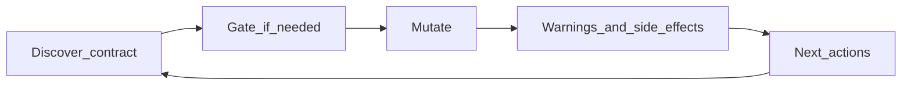

# MCP Server Standards

This is the quality bar we use when we build or change our content MCP server. It is written for **humans** — engineers, reviewers, and anyone who needs to understand *why* our tools behave the way they do.

The Model Context Protocol defines how agents connect and call tools. It does **not** define how those tools should teach blast radius, non-effects, or the next correct call. We filled that gap ourselves.

If you are adding a tool, changing a mutate response, or reviewing an MCP PR, use this document as the checklist. For the narrative case study behind these ideas, see [MCP Has No Quality Standards…](./mcp-has-no-quality-standards-we-wrote-ours-so-agents-can-run-our-website.md). For code-enforced rules, see `.cursor/rules/mcp-server-responses.mdc`.

---

## What we are building

Our MCP is a **content CMS for agents**: YAML entries, sections, SEO/meta, shared-layout shells, translations, diagnostics — across one or more sites.

We optimize for:

1. **Correct writes** — agents do the safe thing without memorizing our CMS.
2. **Honest blast radius** — agents know what happened *and* what did not.
3. **An obvious next call** — follow-ups name real tools, not invented ones.
4. **Token efficiency without losing facts** — dense structure beats long essays.

We do **not** optimize for tool count, README-length tool descriptions, or silent “helpfulness” (like auto-updating every locale behind the agent’s back).

---

## The agent loop (mental model)

Every serious mutate should feel like this:

| Step | Meaning |
|------|---------|
| Discover | Read the contract (`get_content_type_info`, `explain_site`, sample peers) before inventing shape. |
| Gate | If judgment is needed (live edit, layout target, site, new URL-param value), stop and ask — do not hard-fail cryptically. |
| Mutate | Perform the write. |
| Educate | Return structured `warnings` / `side_effects` (paths, non-effects, blast radius). |
| Next | Return `next_actions` with **real** tool names and `args_hint` when you can. |

If any step is “read a paragraph and guess,” the design is unfinished.

---

## Standard 1 — Response envelope

Mutating tools **must** return through `ok` / `fail` / `actionRequired` in `mcp-server/lib/respond.ts` (or re-exports). Do not invent one-off success JSON shapes.

| Shape | When |
|-------|------|
| `ok` | Write succeeded. Always include `warnings` and `next_actions` (arrays; use `[]` when empty). Optional `side_effects`. |
| `fail` | Hard error. Be clear. Do not pretend there is a safe next tool call. |
| `actionRequired` | Soft gate: confirm live edit, pick layout target, supply `site`, confirm new values, etc. May include `next_actions` for the retry. |

**Always say what did not happen.** Non-effects belong in `warnings` with stable `code`s — not only in a friendly `message` paragraph. Agents skim prose; they trust structured fields.

**Inspection/read tools** that only report state should return `next_actions: []` unless a follow-up is required for correctness.

---

## Standard 2 — Dense education for agents

Staff UI and MCP teach the **same facts** at different compression:

- **Staff (UI):** Clear, explanatory, always-visible how-it-works; optional advanced paths; empty states that teach.
- **Agents (MCP):** Short tool descriptions + structured `warnings` / `side_effects` / `next_actions`. Keep payloads efficient **without dropping facts** (which file, locale scope, precedence, non-effects).

A staff paragraph often becomes three MCP fields. That is intentional.

---

## Standard 3 — Guide, don’t silently fan out

- Do **not** auto-fan-out sibling locale shared-layout files from MCP. Guide the agent with `next_actions` instead.
- Use **one** tool set for shared layout and entry overlays. Prefer `layout_target` / `confirm_layout_target` over parallel `*_shared` tools.
- When a shared-template write has blast radius, say so in `reason` / `side_effects` / `warnings` (sibling structure rules, what breaks if they skip follow-ups).

Surprising multi-file writes are worse than an extra round trip.

---

## Standard 4 — Gates over opaque errors

Use `actionRequired` when the agent needs judgment, for example:

- Confirming a **live** edit
- Choosing **entry** vs **type_single** (shared shell)
- Supplying **`site`** on multi-site
- Confirming a **new** URL-param / select value (`confirm_new_values`)

Gates turn “the model guessed” into “the model asked the principal” (human or orchestrator). Permission to write is not permission to invent taxonomy.

---

## Standard 5 — Discover before mutate

Dangerous or structural workflows ship with a playbook (usually `explain_site` topics under `mcp-server/explain/`). The happy path for shared-layout creates is:

1. `list_sites` (if multi-site) → pass `site` afterward  
2. `get_content_type_info` — mapping, required fields, observed values, `create_via`, shared-layout vs DB-backed  
3. `explain_site` when recommended (e.g. `shared-layout`)  
4. Sample peers (`list_entries`)  
5. Mutate (`create_entry` with `sections: []` for attached shared-layout entries)  
6. Verify (`get_entry_content` / `get_entry_seo` / diagnostics)

Do not treat `single_template` and DB-backed as the same thing. Let the contract say `create_via`.

---

## Standard 6 — Exact paths and real tool names

- Validation failures should include **exact property paths** when known (e.g. `sections[2].data.ecommerce_products`, `signup_card.cta_button.tracking`) — not only metaphors like “missing product scope.”
- Put concrete relative file paths in `warnings` / `side_effects` when known.
- `next_actions[].tool` must be a **registered** MCP tool. Never invent tools (`validate_content`, etc.). Prefer `args_hint` so the next call is copy-pasteable.
- Use priorities deliberately: `required` | `recommended` | `optional`.

---

## Standard 7 — Read hygiene

Default reads stay small. Example: unfiltered `list_entry_seo` returns a **minimal sample**; pass `slugs` for full meta.

Prefer filters and search on list tools. Split “content body” reads from “SEO/meta” reads when that saves context. Efficiency is not only about writes — it is about not filling the window with noise.

---

## What we refuse (on purpose)

| Refusal | Why |
|---------|-----|
| Parallel `*_shared` tool families | One vocabulary; use `layout_target`. |
| MCP locale auto-fan-out | Agent orchestrates sibling updates via `next_actions`. |
| Inventing URL-param values without confirmation | Taxonomy is a product decision. |
| Success payloads missing `warnings` / `next_actions` | Empty arrays are honest; missing keys break the contract. |
| Non-effects only in prose | They get skimmed away. |
| Tool-count vanity | Quality is “next call obvious + non-effects clear.” |

---

## Checklist before you ship a mutate tool

- [ ] Returns via `ok` / `fail` / `actionRequired`
- [ ] Always includes `warnings` and `next_actions` (arrays)
- [ ] Documents side effects and non-effects (codes + paths when known)
- [ ] `next_actions` only name real registered tools; `args_hint` where possible
- [ ] No silent locale fan-out; shared-layout uses one tool set + `layout_target`
- [ ] Soft gates for live / layout / site / new values — not cryptic 400s
- [ ] Playbook or `explain_site` topic linked when the shape is dangerous
- [ ] Validation errors include exact property paths when known
- [ ] Default reads stay small
- [ ] Agent education is dense; same facts as staff UI, not a shorter lie

---

## Where knowledge lives

| Artifact | Role |
|----------|------|
| This file (`docs/blog/mcp-standards.md`) | Human-friendly standards |
| `.cursor/rules/mcp-server-responses.mdc` | PR / agent gate for `mcp-server/**` |
| `.cursor/rules/education-layer-planning.mdc` | Staff vs agent education in plans |
| `mcp-server/lib/respond.ts` | Envelope helpers |
| `mcp-server/explain/*` | Runtime playbooks via `explain_site` |
| `mcp-server/README.md` | Connect, auth, tool catalog |

When standards and code disagree, fix the code or update this doc in the same change — do not leave two truths.
